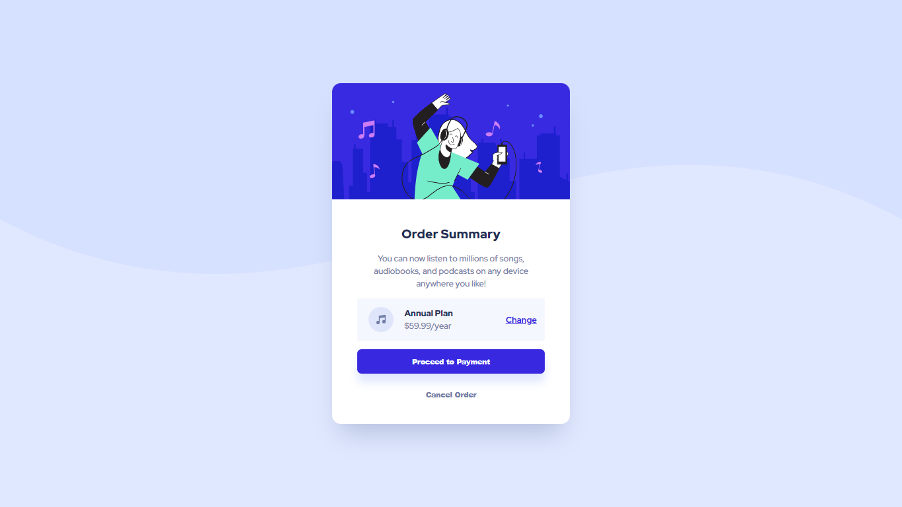

# Frontend Mentor - Order summary card solution

This is a solution to the [Order summary card challenge on Frontend Mentor](https://www.frontendmentor.io/challenges/order-summary-component-QlPmajDUj). Frontend Mentor challenges help you improve your coding skills by building realistic projects. 

## Table of contents

- [Overview](#overview)
  - [The challenge](#the-challenge)
  - [Screenshot](#screenshot)
  - [Links](#links)
- [My process](#my-process)
  - [Built with](#built-with)
  - [Trouble I am Facing](#trouble-i-am-facing)
- [Author](#author)

## Overview

### The challenge

Users should be able to:

- View the optimal layout depending on their device's screen size
- See hover and focus states for interactive elements

### Screenshot

### Links

- Solution URL: [Order Summary - Solution](https://github.com/Mohan823/order-summary.git)
- Live Site URL: [Order Summary - Live](https://mohan823.github.io/order-summary/)

## My process

- Creating variables for future ready responsive website.
- Targetting which one is most important (mobile/desktop)
- Then, I made css for that then convert it for another devices via media queries.

### Built with

- Semantic HTML5 markup
- CSS custom properties
- Flexbox
- CSS Grid

### Trouble I am Facing

- I have in trouble when I m creating my mobile layout. because the container can't shrink itself. 
- But after a cup of tea, I simply close my windows means laptop, and starts thinking. Suddenly a spark came to my mind😎 
- Then come with solution the container isn,t overflowing itself due to that its not shrink. then i add "overflow: hidden;" to container. 
-                        The problem is solved.🥰

## Author

- Frontend Mentor - [Mohan Krishna](https://www.frontendmentor.io/profile/Mohan823)
